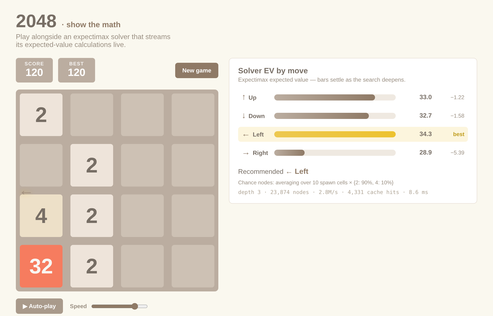

# 2048-Solver

Remember 2048? Let's see how far we can go by making optimal moves.

This is **2048 solver-as-game**: play (or watch) the classic sliding-tile
puzzle alongside an expectimax solver that streams its **expected-value
calculations live**. The "show the math" panel is the whole point — for every
move you see the solver's EV, how confident it is, and how hard it searched.



## Features

- **Play it yourself** with arrow keys / WASD, or swipe on touch devices.
- **Live "show the math" panel** — for each of the four moves: an expected-value
  bar that settles as the search deepens, the delta to the best move, the
  chance-node summary (how many spawn cells are averaged and the 2-vs-4 split),
  and a search-stats line (depth, nodes, nodes/sec, cache hits, elapsed).
- **Recommended-move hint** glows on the board edge, always agreeing with the
  panel's best row.
- **Auto-play** — hand the wheel to the solver and watch, with a Slow–Fast speed
  slider. The math panel keeps streaming the whole time.
- The solver runs in a **Web Worker**, so search never blocks the UI.

## How the solver works

The game alternates between two kinds of turn, and the solver models both with
**expectimax**:

- **Your turn — a _max_ node.** You choose one of the four slides. The solver
  evaluates each and keeps the best expected value.
- **The game's turn — a _chance_ node.** A random tile appears: a **2 with
  probability 0.9** or a **4 with probability 0.1**, on a uniformly-random empty
  cell. The solver averages over every one of those outcomes, weighted by its
  probability.

It can't search to the end of the game, so leaf positions are scored by a static
**heuristic** — a weighted sum of four classic 2048 features:

| Feature | Why it matters |
| --- | --- |
| **Empty cells** | Room to manoeuvre; the single strongest signal. |
| **Monotonicity** | Rows/columns that increase or decrease steadily keep big tiles herded together. |
| **Smoothness** | Neighbouring tiles with similar values line merges up. |
| **Max-in-corner** | Anchoring the largest tile in a corner keeps the board organised. |

Features are computed on tile _exponents_ (a difference of exponents is a log2
tile ratio, which is exactly the scale these features want to reason about).

To stay responsive the search uses **iterative deepening** (depth 1, then 2,
then 3…), which is what makes the EV bars _stream_: you see a quick shallow
estimate immediately and watch it settle as the search deepens. Search depth
adapts to how full the board is — fewer empty cells means a smaller, riskier
tree, so it looks further ahead. A **board+depth transposition table** and a
**probability cutoff** (chance branches too improbable to matter are scored
statically) keep the deeper searches affordable, and dead-end lines collapse to
a large death penalty.

At depth 3 the solver reaches a **median max tile of 4096** in self-play; every
game clears 2048.

## Architecture

```
src/
  engine/     pure game rules — board, slide/merge, spawning, game state
    board.ts, moves.ts, spawn.ts, game.ts
  solver/     the brain — evaluation, search, and the streaming worker
    heuristics.ts, expectimax.ts, analyze.ts, worker.ts, client.ts, simulate.ts
  ui/         DOM rendering and interaction
    board.ts, input.ts, controller.ts, mathPanel.ts, autoplay.ts
  main.ts     wires it all together
```

The `engine` and `solver` layers are pure and framework-free (no DOM), which is
why they're thoroughly unit-tested — including a headless self-play test that
proves the solver actually reaches large tiles.

## Tech stack

- **Vite** + **TypeScript** (strict), no UI framework — plain DOM/CSS.
- **Vitest** for unit tests.
- The solver runs in a **Web Worker** so search never blocks the UI.

## Getting started

```bash
npm install       # install dependencies
npm run dev       # start the dev server (http://localhost:5173)
npm run build     # type-check and produce a production build in dist/
npm run preview   # serve the production build locally
npm test          # run the Vitest suite once
npm run test:watch
npm run typecheck # type-check without emitting
```

## Controls

| Input | Action |
| --- | --- |
| Arrow keys / WASD | Slide tiles |
| Swipe | Slide tiles (touch) |
| **Auto-play** button | Let the solver play; toggle to stop |
| Speed slider | Auto-play pace, Slow → Fast |
| **New game** | Restart |

## License

MIT
